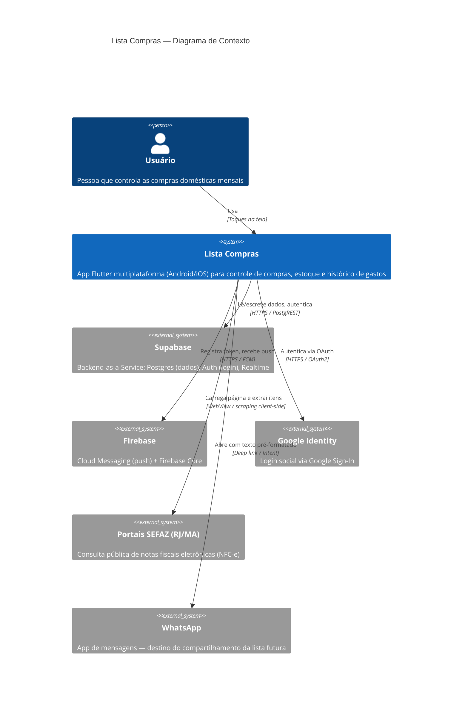
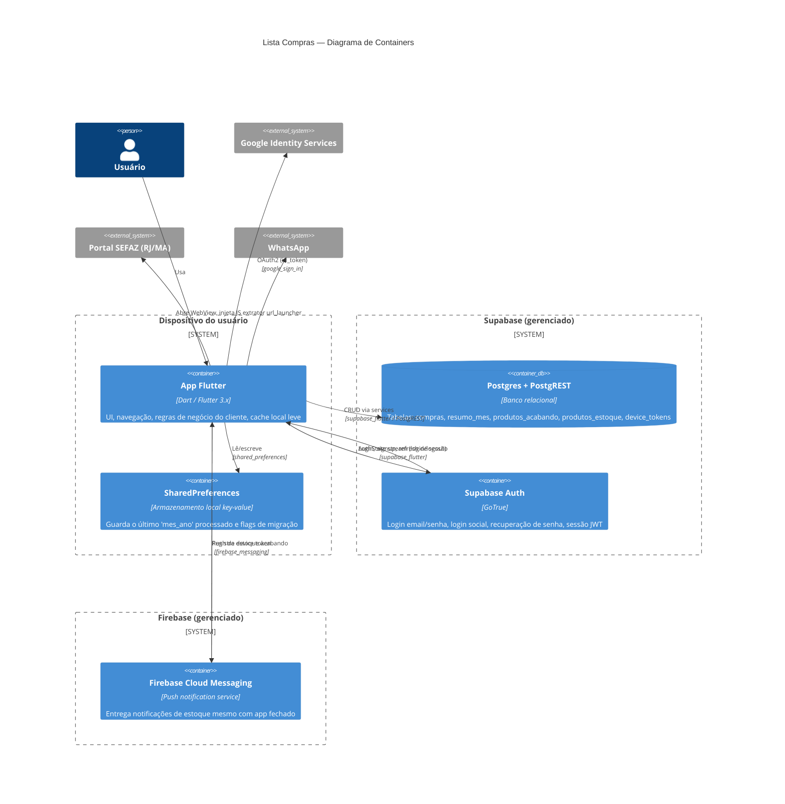
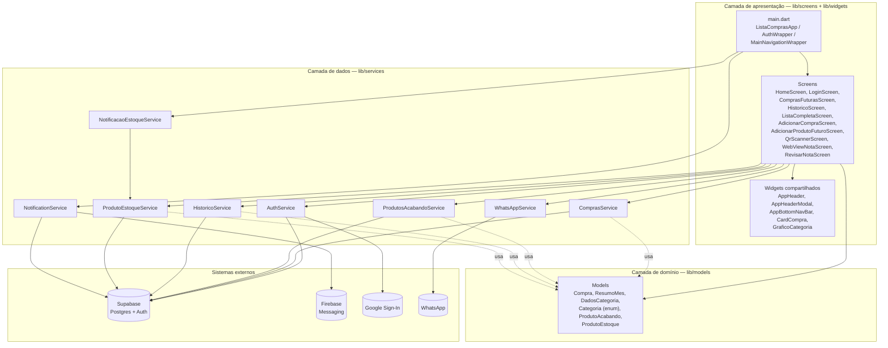

# 01 — Visão Geral da Arquitetura

> **Status**: ativo
> **Última atualização**: 2026-06-11
> **Relacionados**: [02-fluxo-de-dados.md](./02-fluxo-de-dados.md), [03-gerenciamento-de-estado.md](./03-gerenciamento-de-estado.md), [../08-adr/](../08-adr/)

## 1. Objetivo deste documento

Dar a um engenheiro que nunca viu o projeto uma visão de "helicóptero" do sistema: quem usa o app, com quais sistemas externos ele conversa, como o código Flutter está organizado internamente e como uma requisição típica atravessa essas camadas. Detalhes de cada módulo de negócio ficam em `03-modulos/`; aqui o foco é a **forma** do sistema, não o **conteúdo** de cada funcionalidade.

Usamos o modelo **C4** (Context → Container → Component) para os dois primeiros níveis, e uma visão de **camadas** (layers) para descrever a organização interna do app Flutter — que corresponde ao nível "Component" do C4.

---

## 2. Nível 1 — Diagrama de Contexto

Mostra o sistema como uma caixa única, o usuário e os sistemas externos com os quais ele troca dados.

**Pontos importantes para o leitor novo:**

- O app **não tem backend próprio**. Toda a lógica de servidor é Supabase (Postgres + Auth) ou Firebase (push). Não existe uma API REST/GraphQL escrita pelo time — ver [05-contratos-de-api/](../05-contratos-de-api/).
- A integração com a SEFAZ **não é uma API oficial**: o app abre uma `WebView` real apontando para o portal público de consulta de NFC-e e injeta JavaScript para extrair os produtos da página renderizada. Isso é frágil por natureza (depende do HTML do portal) — ver [03-modulos/02-nota-fiscal.md](../03-modulos/02-nota-fiscal.md) e [08-adr/adr-003-webview-nota-fiscal.md](../08-adr/adr-003-webview-nota-fiscal.md).
- O compartilhamento para WhatsApp é "burro": o app monta um texto e delega para o app do WhatsApp via `url_launcher`. Não há API de envio automático.

---

## 3. Nível 2 — Diagrama de Containers

"Container" aqui não é Docker — é terminologia C4 para "unidade de execução implantável separadamente" (o app mobile, o banco gerenciado, o serviço de push, etc.).

**Decisões que moldam este diagrama:**

| Decisão | Por quê | ADR |
|---|---|---|
| Sem backend próprio — Supabase faz o papel de API | Reduz superfície de manutenção; Postgres + RLS cobre as necessidades de autorização do app | [adr-001](../08-adr/adr-001-supabase-vs-firebase.md) |
| Firebase usado **só** para push (FCM), não para dados | Evita duplicar fonte de verdade entre Firestore e Postgres | [adr-001](../08-adr/adr-001-supabase-vs-firebase.md) |
| `shared_preferences` para estado local mínimo | Apenas flags simples (último mês processado, migração já feita) — não é um cache de dados de negócio | — |

---

## 4. Nível 3 — Camadas internas do App Flutter (Component)

Dentro do container "App Flutter", o código em `lib/` segue uma separação por responsabilidade. Não é uma arquitetura em camadas rígida (tipo Clean Architecture com casos de uso isolados) — é um padrão pragmático **Screens → Services → Models**, comum em apps Flutter de porte pequeno/médio.

### 4.1 O que cada camada faz

**`lib/main.dart` — composição raiz**
Define `ListaComprasApp` (MaterialApp + tema), `AuthWrapper` (decide entre tela de login e app principal via `StreamBuilder<AuthState>`) e `MainNavigationWrapper` — o "orquestrador" stateful que guarda em memória as listas (`_comprasMesAtual`, `_historico`, `_produtosAcabando`), chama os services para carregar/persistir, e repassa callbacks para as screens. Ver [03-gerenciamento-de-estado.md](./03-gerenciamento-de-estado.md).

**`lib/screens/` — apresentação**
Cada arquivo é uma tela ou modal (`fullscreenDialog`). Screens **não acessam o Supabase diretamente** — recebem dados e callbacks via construtor a partir do `MainNavigationWrapper` ou navegam empurrando outra screen via `Navigator.push`. Exceções pontuais existem (ex.: `ComprasFuturasScreen` chama `WhatsAppService` diretamente, pois é uma ação local sem efeito no estado global).

**`lib/widgets/` — componentes reutilizáveis**
`AppHeader`/`AppHeaderModal` padronizam a AppBar; `CardCompra` é o item de lista reutilizado em `HomeScreen` e `ListaCompletaScreen`; `GraficoCategoria` desenha o gráfico de pizza com `CustomPainter`; `AppBottomNavBar` é a navegação inferior fixa. Detalhes em [../09-design-system/02-componentes-reutilizaveis.md](../09-design-system/02-componentes-reutilizaveis.md).

**`lib/models/` — domínio**
Classes de dados imutáveis (`Compra`, `ResumoMes`, `ProdutoAcabando`, `ProdutoEstoque`) com `copyWith`, mais o enum `Categoria` e o agregado `DadosCategoria` (usado só para alimentar o gráfico). Não têm dependência de Flutter nem de Supabase — são POJOs/PODOs do Dart.

**`lib/services/` — acesso a dados e integrações**
Um service por entidade/preocupação, todos seguindo o mesmo padrão: método público assíncrono → chamada ao `Supabase.instance.client` → mapeamento `Map<String, dynamic>` ↔ model. `AuthService` e `NotificationService` são exceções por integrarem com Google Sign-In e Firebase, respectivamente. `NotificacaoEstoqueService` é o único service que depende de outro service (`ProdutoEstoqueService`) e de `BuildContext` (para exibir diálogos).

### 4.2 Mapeamento pasta → responsabilidade

| Pasta | Conteúdo | Depende de |
|---|---|---|
| `lib/main.dart` | Composição raiz, estado global da sessão de compras do mês | screens, services, models |
| `lib/screens/` | Telas e modais | widgets, models, services (parcial), Navigator |
| `lib/widgets/` | Componentes visuais reutilizáveis | theme, models |
| `lib/models/` | Entidades de domínio + enums | nada (puro Dart) |
| `lib/services/` | Acesso a Supabase, Firebase, Google, WhatsApp | `supabase_flutter`, `firebase_*`, `google_sign_in`, `url_launcher`, models |
| `lib/theme/` | `AppColors`, `AppTheme` | nada |

---

## 5. O que **não** existe (e por quê isso é uma decisão válida)

Para evitar que o leitor procure por algo que não está lá:

- **Não há camada de "repository" abstrata** separada dos services — os services já fazem esse papel. Introduzir uma interface `Repository<T>` hoje seria over-engineering para o tamanho do app.
- **Não há injeção de dependência (DI)** — services são instanciados diretamente (`final _comprasService = ComprasService();`) dentro das classes State. Funciona porque os services são *stateless* (apenas encapsulam chamadas ao Supabase) e não precisam ser mockados em testes de unidade ainda (ver [07-guias-dev/04-testes.md](../07-guias-dev/04-testes.md) sobre o estado atual da cobertura).
- **Não há gerenciador de estado global (Provider/Riverpod/Bloc)** — o estado de negócio vive no `MainNavigationWrapper` e é passado para baixo via construtor. Trade-offs documentados em [adr-002](../08-adr/adr-002-setstate-vs-riverpod.md).

---

## 6. Próximos documentos recomendados

1. [02-fluxo-de-dados.md](./02-fluxo-de-dados.md) — como esses containers/camadas interagem num caso real (ex.: adicionar uma compra)
2. [03-gerenciamento-de-estado.md](./03-gerenciamento-de-estado.md) — detalhe do `setState` e do `StreamBuilder` de autenticação
3. [04-navegacao-e-rotas.md](./04-navegacao-e-rotas.md) — como as screens se conectam via `Navigator`