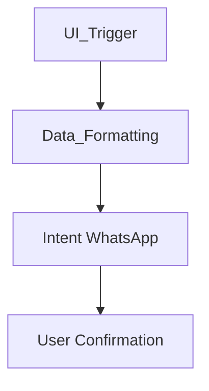

# Prompt de Documentação: Compartilhamento via WhatsApp

**Persona Aplicada:** persona-08.md (Especialista em Documentação Técnica e Arquitetura de Software)

## Metadados do Prompt (obrigatório)
- **Persona-Version:** persona-08
- **Prompt-File:** prompt-02-documentacao-compartilhamento-whatsapp.md
- **Projeto:** lista_compras
- **Data de Criação:** <YYYY-MM-DD HH:MM>  <!-- substitua pela data de geração -->

---

## Objetivo
Gerar a documentação técnica detalhada da funcionalidade **Compartilhamento via WhatsApp** do aplicativo `lista_compras`. A IA deve analisar o código‑fonte e produzir um documento Markdown que contenha:

1. Visão geral da funcionalidade.
2. Análise técnica da implementação (dependências, fluxo de dados, lógica de formatação).
3. Walkthrough do código (trechos relevantes com explicação).
4. Diagrama de fluxo (texto ou Mermaid).
5. Considerações de UX e edge cases.
6. Metadados obrigatórios e mapa de evidência associados.

---

## Contexto de Análise
A IA deve vasculhar todo o diretório do projeto (`C:\Users\EudFr\OneDrive\Documentos\VSCODEPROJETOS\lista_compras\flutter_application_1\lista_compras`) em busca de:

- Dependências no `pubspec.yaml` relacionadas a compartilhamento (ex.: `share_plus`, `url_launcher`).-*
- Classes de serviço ou helpers que formatam a lista de compras em texto.
- Widgets de UI que disparam a ação de compartilhamento.
- Lógica de negócio que filtra/organiza os itens antes do envio.
- Eventuais verificações de disponibilidade do WhatsApp ou tratamento de erros.

---

## Instruções para a IA (pipeline determinístico)
1. **Ingestão** – Detectar o tipo dos arquivos (Dart, YAML, assets) e ler seu conteúdo.
2. **Normalização** – Uniformizar formatação de trechos de código (indentação, remover comentários redundantes).
3. **Extração por Seção** – Identificar trechos relevantes e mapear para as seções do documento final (Visão Geral, Dependências, Fluxo de Dados, etc.).
4. **Captura de Proveniência** – Para cada informação extraída registrar:
   - **ID de Evidência** (`EV-02-<SEÇÃO><N>`).
   - **Fragmento Inicial** e **Fragmento Final**.
   - **Localização** (caminho do arquivo + linha).
   - **Timestamp** de extração (ISO 8601).
5. **Atribuição de Metadados** – Preencher os campos obrigatórios do documento gerado:
   - Projeto, Documento gerado em, Status, Responsável técnico, Persona-Version, prompt-usado, Evidence-Map-Output.
6. **Geração do Mapa de Evidência** – Criar o arquivo `docs/prompts/mapas_de_evidencias/mapa-02-compartilhamento-whatsapp.md` contendo a tabela de evidências (conforme modelo da Persona‑08).
7. **Preenchimento do Documento** – Incluir os trechos de código, diagramas e explicações nas seções correspondentes, mantendo a redação original das fontes (sem parafrasear).
8. **Checklist Final (QA)** – Verificar que todas as informações têm evidência registrada, que o mapa de evidência contém apenas IDs citados no documento e que os Metadados Obrigatórios estão preenchidos.

---

## Estrutura Esperada da Saída (Documento Gerado)
```markdown
# Documentação – Compartilhamento via WhatsApp

## Metadados do Documento (obrigatório)
- **Projeto:** lista_compras
- **Documento gerado em:** <YYYY-MM-DD HH:MM>
- **Status:** v1.0-draft (DOC-2026-001)
- **Responsável técnico:** Arquitetura de Software
- **Persona-Version:** persona-08
- **prompt-usado:** prompt-02-documentacao-compartilhamento-whatsapp.md
- **Evidence-Map-Output:** docs/prompts/mapas_de_evidencias/mapa-02-compartilhamento-whatsapp.md

---

## 1. Visão Geral da Funcionalidade
... (preencher com descrição encontrada no código) ...

## 2. Análise Técnica de Implementação
### 2.1 Dependências
... lista de pacotes ...

### 2.2 Fluxo de Dados
... step‑by‑step ...

### 2.3 Lógica de Formatação
... detalhes ...

## 3. Walkthrough do Código
```dart
// Trecho de código relevante
```
**Evidência(s):** `EV-02-VIS001`
...

## 4. Diagrama de Fluxo


## 5. Considerações de UX e Edge Cases
... (ex.: lista vazia, WhatsApp ausente) ...

## Checklist Final (QA)
- [ ] Todas as informações têm Evidência registrada.
- [ ] O Mapa de Evidência contém somente IDs citados no documento.
- [ ] Metadados obrigatórios preenchidos.
- [ ] Diagrama incluído.
```

---

## Instruções Adicionais
- **Não inventar funcionalidades** – basear‑se estritamente nos arquivos presentes.
- **Manter a redação original** das descrições encontradas nos comentários ou README.
- **Usar o modelo de Metadados** exatamente como especificado na Persona‑08.
- **Gerar o Mapa de Evidência** com as colunas: ID, Seção(ões), Tipo, Fragmento Inicial, Fragmento Final, Localização, Data de Extração, Status, Notas.
- **Sincronizar** os Metadados entre o documento e o Mapa de Evidência.
- **Inserir placeholders** (`<...>`) onde a informação ainda não está disponível, marcando-a como pendente no Mapa.

---

*Este prompt‑template é autocontido, determinístico e rastreável; ao ser executado produzirá a documentação solicitada e o mapa de evidência correspondente.*